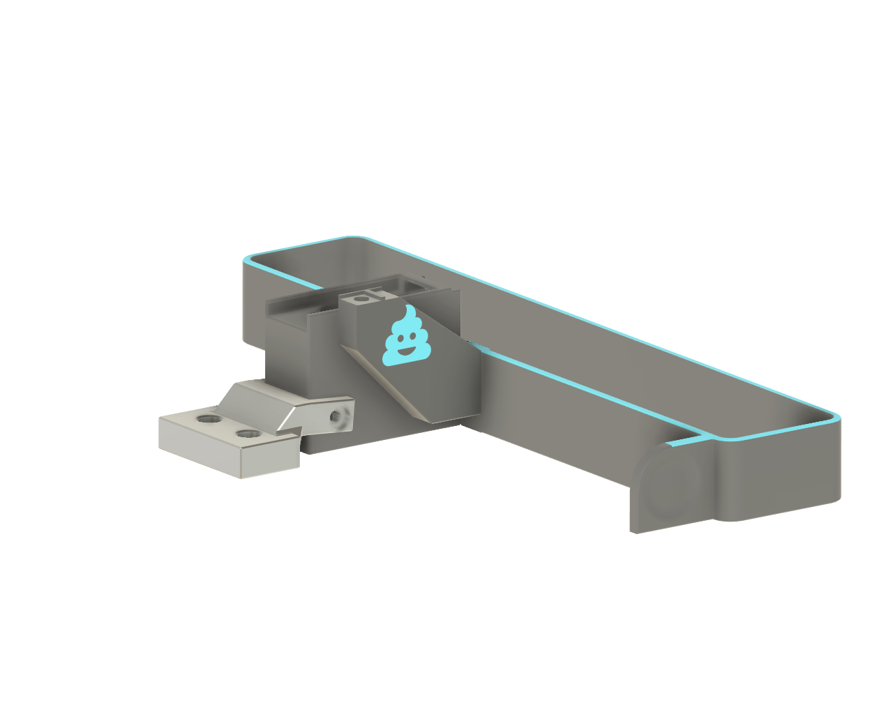
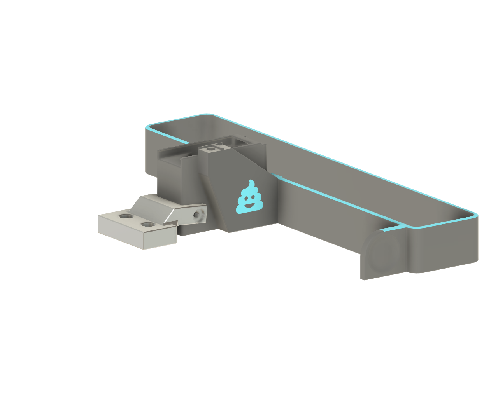

# A4T Shaker Arm Mod

A modified version of the shaker arm and shaker to fit the A4T toolhead.

## Variations Against the Stealth Burner Shaker Design

1. One M3x8 SHCS screw is needed to mount the shaker on the shaker arm.  
2. The shaker and shaker arm have indentations to align themselves to each other and prevent the shaker from twisting on the shaker arm, removing the need for the second M3 screw.  
3. The shaker and shaker arm have been made slimmer in the X direction to ease clearance between the front left Z belt and the shaker when inserting and removing the bucket from the printer.

## Which version to pick

### Shaker
There are two versions of the shaker. Depending on your bed placement and overall z height of your blobifier you may get a better shaking "experience" with the Shaker_A4T_tighter_fit model. 

### Shaker arm
There are two versions of the shaker arm. If you experience the arm sagging with the normal version you can try the Shaker_Arm_A4T_flat_with_deck model.

| Normal arm | Flat with deck model |
|---|---|
|  |  |

## Important configuration setup!

As the blobifier shaker arm sits above the plane of the bed, you have to ensure your minimum toolchange z height is adequate for the rear of the toolhead to clear the shaker arm when performing the cutting motion. 

As such, it is strongly advised to set it to approximately 15-20mm, (variable_min_toolchange_z : 15.0) to ensure no chance of collisions with the shaker arm and the mounting location of your bed probe at the rear of the toolhead.

## Bill of Materials (BOM)

### Printed Parts
- **Bucket_*.stl** (whichever suits your printer and print bed) – same as the Blobifier STL’s folder  
- **Shaker_A4T.stl**  
- **Shaker_Arm_A4T.stl**
Print using standard Voron part settings

### Hardware
- Same as the Blobifier. You won’t need the third M3x8 FHCS screw.

## Assembly

1. **Insert 3x M3 heat set inserts** in the shaker arm. Use an exacto knife or metal object to “level” the heat sets with the part, ensuring the inserts are flush with the surface of the arm and no excess material is oozing out.  
2. **Mount the arm to the bucket** (with the poo logo upright) using 2x M3x8 FHCS screws.  
3. **Align the shaker notches** to the arm and secure with the M3x8 SHCS screw.

## Calibration

Install and calibrate your shaker Z height as per the Happy Hare instructions.

- In a Voron 350, you might set `variable_shaker_arm_z` to `2mm`.  
- If the A4T is rubbing against the bottom of the shaker, increase slightly to `2.5mm` or `3mm`.  
- If using a beacon/cartographer or similar bed probe, it is recommended to set variable_min_toolchange_z : 15.0.

## Video

Happy printing!
